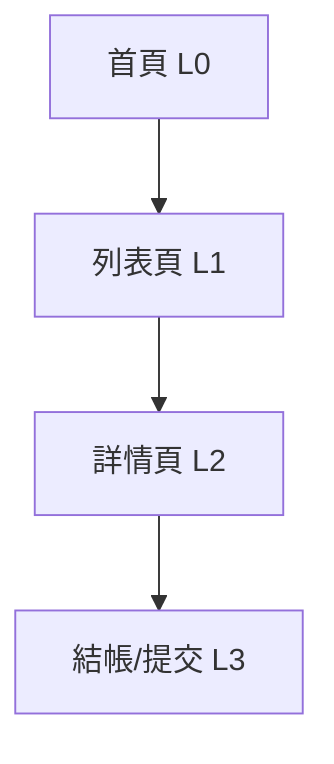

# 資訊架構 (IA) - [專案名稱]

> **版本:** v1.0 | **更新:** YYYY-MM-DD | **狀態:** 草稿/審核中/已批准
> **Owner:** 產品＋設計；工程審閱路由表
> **語域:** L2（橋接）
>
> **MECE 邊界**：本文件只談**全站結構**——頁面總覽、導航、URL 路由、跨頁資料載體。
> 使用者旅程歸 [`ux_research_and_journey.md`](./ux_research_and_journey.md)；單頁規格歸 [`ui_spec.md`](./ui_spec.md)；
> 框架、效能、狀態管理選型等技術視角依需增建（前端技術設計）。
> **實例:** 單例（全站一份）

設計原則（質化）：每頁 1 個主要目標；同類動作同一位置；進階功能漸進揭露；導航深度 ≤ 3 層。

---

## 目錄

- [1. 頁面總覽](#1-頁面總覽)
- [2. 導航結構](#2-導航結構)
- [3. URL 結構與路由表](#3-url-結構與路由表)
- [4. 跨頁資料模型](#4-跨頁資料模型)
- [5. 檢查清單](#5-檢查清單)
- [6. 追溯](#6-追溯)

## 1. 頁面總覽

| # | 路由 | 頁面名稱 | 主要職責（單一） | 使用者目標 | 層級 |
| :--- | :--- | :--- | :--- | :--- | :--- |
| 0 | `/` | 首頁 | [職責] | [目標] | L0 |
| 1 | `/[path]` | [名稱] | [職責] | [目標] | L1 |

**總計:** [N] 頁。每頁的欄位、狀態、互動細節見各頁 `ui_spec`。

---

## 2. 導航結構

| 項目 | 連結 | 顯示條件 |
| :--- | :--- | :--- |
| [主導航項] | `/path` | 永遠顯示 |
| [主導航項] | `/path` | 登入後 |

- 麵包屑：[規則——例：層級 ≥ 2 才顯示，可回溯到 L0]
- Footer／側邊欄：[內容與適用頁面]
- 返回機制：瀏覽器 back / 顯式 back button / 兩者

---

## 3. URL 結構與路由表

命名規範：小寫連字符（`/user-profile`）；資源 ID `/resources/:id`；巢狀 `/users/:userId/orders/:orderId`；過濾/排序用查詢參數（`?status=active&sort=-created`）；URL 不透露 token 或內部 ID。

| 路由 | 頁面 | 認證 | 角色 | 載入策略 |
| :--- | :--- | :--- | :--- | :--- |
| `/` | HomePage | 否 | 任意 | 預載 |
| `/login` | LoginPage | 否 | 訪客 | 懶載入 |
| `/admin/*` | AdminPages | 是 | admin only | 懶載入 |

> 「認證/角色」是 IA 決策（誰能看什麼）；守衛實作屬前端技術設計（依需增建），並與 `api_spec` §4 安全性一致。

---

## 4. 跨頁資料模型

| 來源頁面 | 目標頁面 | 載體 | 資料內容 | 為何選此載體 |
| :--- | :--- | :--- | :--- | :--- |
| [列表頁] | [詳情頁] | URL params (`:id`) | resource_id | 可分享／可書籤 |
| [篩選頁] | [列表頁] | URL query | filter state | 可分享／SEO |
| [登入] | 已認證頁 | shared session store | user／token | 跨頁不變、不可分享 |

載體選擇原則：**能放 URL 就放 URL**（可分享、back 自然）；不可分享的敏感／過渡狀態才進 store；單頁內部用 props／local state，不上 URL 或 store。

---

## 5. 檢查清單

- [ ] 每頁在 §1 有單一職責，且有對應 `ui_spec`
- [ ] 每個路由的認證/角色已明確（§3）
- [ ] 導航深度 ≤ 3 層，麵包屑可回溯到 L0
- [ ] URL 語義化、可分享、不含機密
- [ ] 跨頁資料載體符合 §4 原則
- [ ] 404／空狀態有引導返回主旅程的 CTA

---

## 6. 追溯

| 項目 | ID |
| :--- | :--- |
| 對應需求 | FR-* |
| 對應旅程 | `ux_research_and_journey.md` §4–5 |
