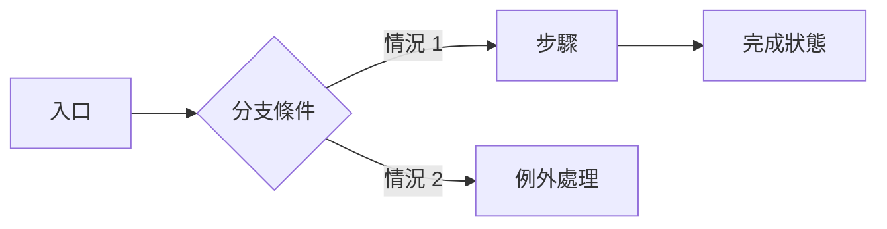

# UX 研究與使用者旅程 - [專案名稱]

> **版本:** v1.0 | **更新:** YYYY-MM-DD | **狀態:** 草稿/審核中/已批准
> **Owner:** UX / PM
> **回答的問題:** 使用者在什麼情境下、用什麼順序完成什麼任務？哪裡會卡住？
> **語域:** L1（業務）
> **實例:** 單例（整個產品一份）

---

## 目錄

- [1. 研究計畫 (Research Plan)](#1-研究計畫-research-plan)
- [2. 研究發現 (Research Report)](#2-研究發現-research-report)
- [3. Persona](#3-persona)
- [4. 使用者旅程 (Journey Map)](#4-使用者旅程-journey-map)
- [5. User Flow / Task Flow](#5-user-flow--task-flow)
- [6. 可用性測試 (Usability Testing)](#6-可用性測試-usability-testing)
- [7. 追溯](#7-追溯)

## 1. 研究計畫 (Research Plan)

| 項目 | 內容 |
| :--- | :--- |
| **研究目標** | [要回答的決策問題，不是「了解使用者」這種空話] |
| **對象與招募** | [角色、人數、篩選條件] |
| **方法** | [訪談 / 觀察 / 問卷 / 可用性測試] |
| **訪談題綱** | [連結或附錄] |

---

## 2. 研究發現 (Research Report)

| 發現 | 證據（訪談座標） | 對產品的意義 |
| :--- | :--- | :--- |
| [痛點或行為模式] | [SRC-*：第幾場訪談、逐字稿位置] | [需求機會或設計約束] |

---

## 3. Persona

| 項目 | Persona A | Persona B |
| :--- | :--- | :--- |
| **角色** | [例：外勤師傅] | |
| **目標** | | |
| **痛點** | | |
| **使用情境／裝置** | | |

---

## 4. 使用者旅程 (Journey Map)

| 階段 | 使用者行為 | 情緒 | 痛點 | 產品機會 | 轉換率目標 |
| :--- | :--- | :--- | :--- | :--- | :--- |
| [預約] | [填寫問題與時間] | 不確定 | [不知道價格] | [提供估價範圍] | [%或事件] |
| [等待] | | 焦慮 | | | |
| [完成] | | 放鬆 | | | |

---

## 5. User Flow / Task Flow

- 每條 flow 標注：入口、決策點、例外路徑、完成的可觀察結果。
- 全站頁面層級、導航與路由歸 [`information_architecture.md`](./information_architecture.md)；單頁細節歸 [`ui_spec.md`](./ui_spec.md)。

---

## 6. 可用性測試 (Usability Testing)

| 任務 | 完成率 | 卡點 | 改善項目 |
| :--- | :--- | :--- | :--- |
| [建立工單] | [n/N] | [找不到入口] | [對應 UI Spec 變更] |

---

## 7. 追溯

- 洞察 → 需求：發現以 `SRC-*` 進入 `/intake` 的來源登錄，不直接改寫 PRD。
- 流程 → 畫面：User Flow 的每個節點對應 [`ui_spec.md`](./ui_spec.md) 的頁面或狀態。
