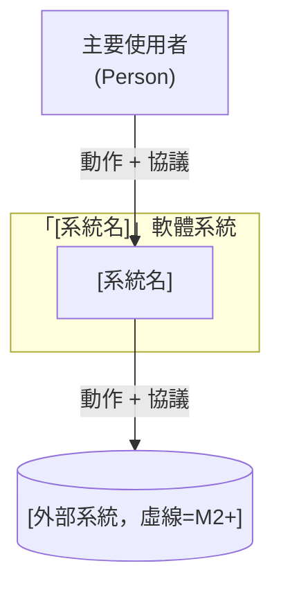
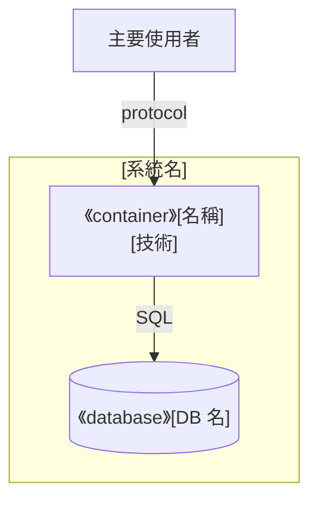
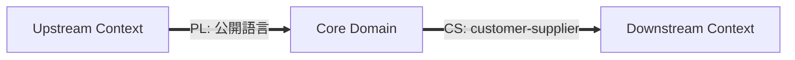
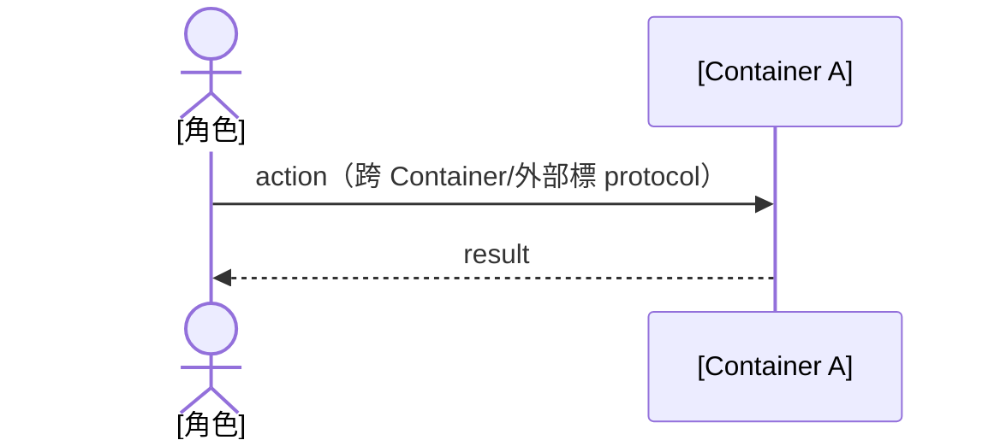
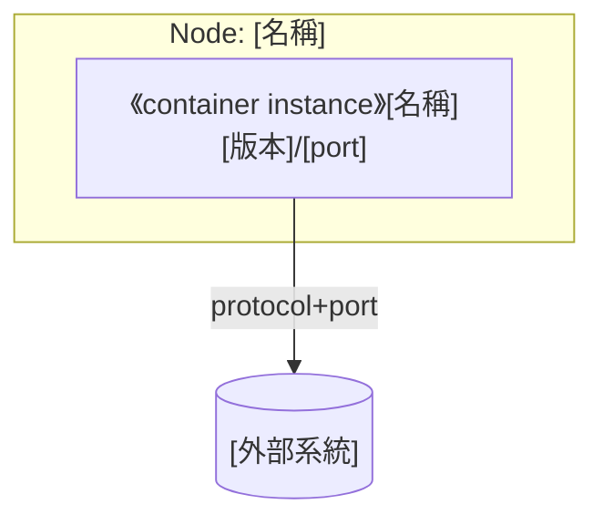

# 軟體架構文件 (SAD) - [專案名稱]

> **版本:** v3.0 | **更新:** YYYY-MM-DD | **狀態:** 草稿/審核中/已批准
> **Owner:** 架構師
> **語域:** L2（橋接）
>
> **定位**：系統級架構的單一真實來源——C4 L1–L3、DDD 邊界、資料與部署視圖。回答「系統由哪些 runtime 組成、邊界在哪、為什麼」。
> Code 層（模組依賴、類別、狀態機）歸 [`../04_design/lld.md`](../04_design/lld.md)；API／資料契約歸 `../04_design/`；架構決策理由歸 [`adr.md`](./adr.md)。
> 圖的載體分工：本文件內 mermaid 是工程正典；對外溝通級大圖（Solution Overview／Context／Container／Deployment 的 drawio 版）見 [`diagrams/`](./diagrams/README.md)，同一視圖二擇一、不得雙軌維護。
> **實例:** 單例（系統架構契約只有一份）

## 目錄

- [1. C4 架構視圖](#1-c4-架構視圖)
- [2. DDD 邊界與分層](#2-ddd-邊界與分層)
- [3. 技術選型](#3-技術選型)
- [4. 需求摘要](#4-需求摘要)
- [5. 關鍵使用者旅程](#5-關鍵使用者旅程)
- [6. 資料架構](#6-資料架構)
- [7. 部署視圖](#7-部署視圖)
- [8. 跨領域考量](#8-跨領域考量)
- [9. 風險與演進](#9-風險與演進)
- [10. 架構審查清單](#10-架構審查清單)
- [11. 追溯](#11-追溯)

## 1. C4 架構視圖

**命名防呆**：C4 L1–L4 是圖的縮放層級（Context→Container→Component→Code），≠ 業務分層、≠ Clean Architecture 層、≠ DDD 限界上下文。業務名詞撞名時，C4 章節強制用全稱（`System Context`／`Container`）。

| 層級 | 一張圖只回答 | 方塊必須是 | 禁止 |
| :---: | :--- | :--- | :--- |
| L1 Context | 誰在用？與哪些外部系統互動？ | 人、本系統（一個邊界）、外部系統 | 內部模組、開發工具（GitHub/IDE/CI）|
| L2 Container | 系統內有哪些 **runtime**？ | process、DB、檔案儲存、排程、UI | 把 module 當容器 |
| L3 Component | **某一個** Container 內部怎麼拆？ | 模組／package（對應 repo 路徑）| 跨容器混畫 |
| L4 Code | 類別／函式 | — | 本文件不畫，歸 `lld.md` |

### 1.1 L1 — System Context



規則：邊界內僅一個系統節點；外部系統列**完整**（資料源、交易、推送、備份、雲端五類，缺類要註明「無」）；虛線＝未啟用 milestone；箭頭標協議＋動詞。

### 1.2 L2 — Container

| Container | 類型 | 技術 | 何時啟用 | L3 揭露 |
| :--- | :--- | :--- | :---: | :---: |
| [名稱] | process/DB/UI | [技術] | 現在/M2+ | ✅／表代圖／略（理由）|



規則：跨 Container 箭頭標 protocol；Clean Architecture 分層不畫進 L2（見 §2）；有 milestone 的系統**另畫一張全實線的 future state L2**，不能只靠虛線。

### 1.3 L3 — Component（每個 Container 一張）

畫法同 §1.2，subgraph＝該 Container、方塊＝模組（對應 repo 路徑）。規則：標題含父 Container；一張圖對應**且僅對應**一個 Container；DB 可表代圖（指向 §6 ER）、第三方服務可略（註明理由）；箭頭語意明說（import／data flow／call）。

## 2. DDD 邊界與分層

DDD **限界上下文** ≠ C4 System Context。通用語言（術語表）是跨檔單一定義來源：

| 術語 | 定義 |
| :--- | :--- |
| [領域詞] | [唯一定義；撞名 C4 時加前綴] |

### 2.1 Context Map（箭頭＝Strategic Relationship，不是 data flow）



縮寫：PL＝Published Language、CS＝Customer-Supplier、ACL＝防腐層、CF＝Conformist、SK＝Shared Kernel、OHS＝Open Host Service。

### 2.2 戰術元素對應

| DDD 元素 | 程式碼位置 | 備註（缺席要說明為什麼）|
| :--- | :--- | :--- |
| Entity／Aggregate Root／Value Object | | |
| Domain Service／Event／Repository／ACL | | |

### 2.3 Clean Architecture 分層

| 層 | 程式碼位置 | 職責 |
| :--- | :--- | :--- |
| Domain | | 核心業務規則 |
| Application | | Use Cases |
| Infrastructure | | DB／API client／MQ |

Clean Arch 是**邏輯分層**、C4 Container 是**物理 runtime**，不混畫。

## 3. 技術選型

| 分類 | 選用 | 理由 | 備選 | ADR |
| :--- | :--- | :--- | :--- | :--- |
| 後端框架／DB／快取／MQ／CI/CD | | | | ADR-* |

## 4. 需求摘要

- FR-*: [功能一句話]（對應 US-*／DEC-*）

| NFR 分類 | 需求 | 目標值 |
| :--- | :--- | :--- |
| 性能 | API P95 延遲 | < 200ms |
| 可用性／安全性 | | |

## 5. 關鍵使用者旅程

跨多 Container 的主要 use case 必須用 sequenceDiagram（文字步驟不算）；每個 use case 一張；失敗分支用 `alt`。



## 6. 資料架構

```mermaid
erDiagram
```

DB table 細節只畫在這裡，不進 L3。

一致性策略（強一致／最終一致場景）與資料合規（PII、加密、保留）各一句。

## 7. 部署視圖

Deployment ＝ L2 Container 的**物理實體化**（不是重畫 L2）：每個 Container instantiate 到具體 Node，含 OS／規格／port／scaling。



| 環境 | Deployment 模式 | 高可用／Backup／監控 |
| :--- | :--- | :--- |
| Dev／Staging／Production | | |

有 future state（§1.2）就要有對應的目標環境部署圖。CI/CD 與成本歸 [`../06_ops/deployment_and_operations.md`](../06_ops/deployment_and_operations.md)。

## 8. 跨領域考量

| 維度 | 方案 | 狀態 |
| :--- | :--- | :--- |
| 日誌／指標（SLI/SLO）／追蹤／告警 | | |
| 安全（威脅模型、認證授權、機密管理）| | |

## 9. 風險與演進

| 風險 | 可能性 | 影響 | 緩解 |
| :--- | :--- | :--- | :--- |

演進路線：Phase 1 (MVP) → Phase 2 → …（每 Phase 一句範圍與目標，對應里程碑 M*）。

## 10. 架構審查清單

- [ ] L1–L3 各至少一張圖、一圖一層級；每個 L2 Container 有 L3 或明確跳過理由
- [ ] L1 外部系統五類完整；L2 含所有規劃中 Container；有 future state 圖
- [ ] 所有跨 Container／跨 Node 箭頭標 protocol＋動詞
- [ ] 無 C4 與業務層級名稱混用；Context Map 箭頭是 Strategic Relationship
- [ ] 至少一張 Sequence Diagram；Deployment 圖含 Node 屬性
- [ ] 拆新 process 先改 L2 再加 L3；架構變動同步 `lld`／`deployment_and_operations`

## 11. 追溯

| 項目 | ID／連結 |
| :--- | :--- |
| 上游 | DEC-*／FR/NFR-*（`requirements_tracker` ①、prd/srs）|
| 決策 | ADR-*（新決策才新增，既有決策引用）|
| 下游 | `lld.md`（Code 層）、`api_spec`／`db_design`（契約）、`engineering_tracker.xlsx` ①規格追溯 |

**鐵律**：本文件是架構契約——任何模組在此沒出現，等於不存在；其他文件提到而本文件沒提到，是本文件的 bug。

| 版本 | 日期 | 變更 |
| :--- | :--- | :--- |
| v3.0 | 2026-07-26 | 依 template_standard 正規化：統一編號、TOC、教學內容壓縮為規則註、Code 層移交 lld、修正舊編號引用 |
