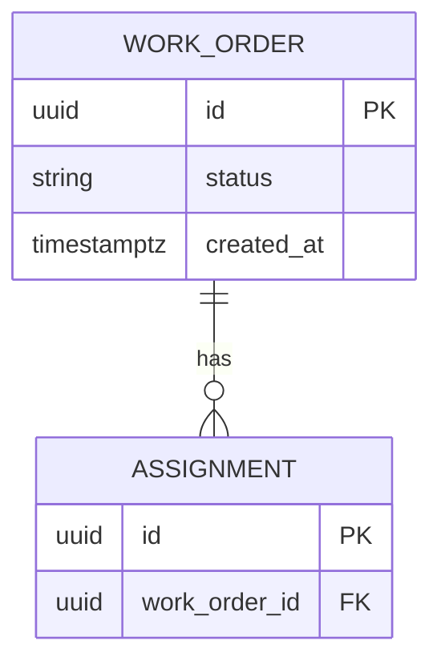

# 資料庫設計 (DB Design) - [專案名稱]

> **版本:** v1.0 | **更新:** YYYY-MM-DD | **狀態:** 草稿/審核中/已批准
> **Owner:** 後端 / 資料工程
> **原則:** Schema 是契約。migration 檔是實作真相，本文件記錄設計意圖與字典；兩者用版本號對齊。
> **語域:** L3（工程）
> **實例:** 每資料庫一份（通常單例）

---

## 目錄

- [1. ERD](#1-erd)
- [2. 表格定義](#2-表格定義)
- [3. 資料字典 (Data Dictionary)](#3-資料字典-data-dictionary)
- [4. 索引與效能](#4-索引與效能)
- [5. 資料保留與遷移](#5-資料保留與遷移)
- [6. 追溯](#6-追溯)

## 1. ERD

---

## 2. 表格定義

### `work_order`

| 欄位 | 型態 | 約束 | 說明 |
| :--- | :--- | :--- | :--- |
| `id` | uuid | PK | |
| `status` | enum | NOT NULL | 合法值與轉移規則見 `lld.md` §5 狀態機 |
| `created_at` | timestamptz | NOT NULL, default now() | |

---

## 3. 資料字典 (Data Dictionary)

| 欄位 | 業務語意 | 來源 | 敏感等級 |
| :--- | :--- | :--- | :--- |
| `work_order.status` | [業務上代表什麼] | FR-* | 一般 |
| [個資欄位] | | | **PII：加密／遮罩策略** |

---

## 4. 索引與效能

| 索引 | 欄位 | 支撐的查詢 | 依據 |
| :--- | :--- | :--- | :--- |
| `idx_wo_status_created` | (status, created_at) | [列表頁預設查詢] | NFR-001 |

---

## 5. 資料保留與遷移

| 項目 | 政策 |
| :--- | :--- |
| **保留期限** | [N 年後歸檔／刪除；法規依據] |
| **Migration 策略** | [工具、向前相容原則、rollback 方式] |
| **種子資料** | [位置與用途] |

---

## 6. 追溯

- 資料需求來源：`../01_requirements/srs.md` §3
- API 資料模型對齊：[`api_spec.md`](./api_spec.md) §6（欄位命名不得各自為政）
- Schema 變更觸發：SAD 資料段與追溯矩陣同步（見 git-workflow 觸發表）
