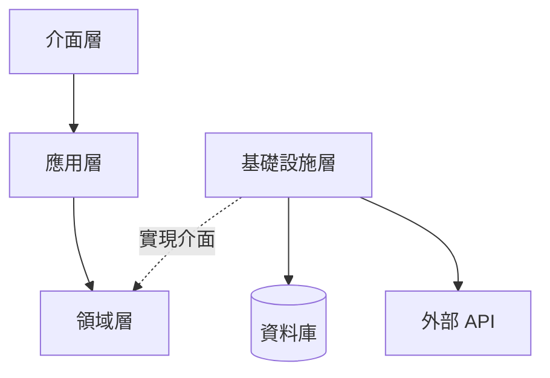
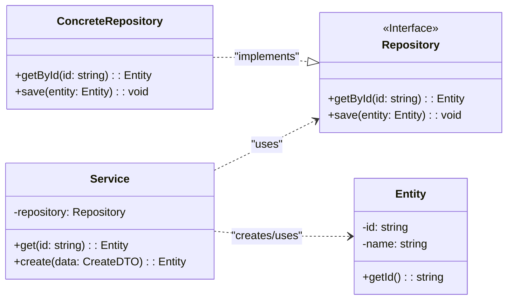

# 低階設計 (LLD) - [專案名稱]

> **版本:** v1.0 | **更新:** YYYY-MM-DD | **狀態:** 草稿/已批准
> **定位:** C4 的 Code 層。描述專案結構、模組依賴與類別關係——SAD 看整體、SDS 看服務內部，LLD 看到檔案與類別。小專案通常必要時才展開，由 SAD/SDS 連結至此。

---

## 1. 專案結構

### 設計原則

- **按功能組織**: 相關功能放一起 (非按類型分散)
- **明確職責**: 每個目錄單一職責
- **一致命名**: 目錄 `kebab-case`、Python `snake_case.py`、測試 `test_` 開頭
- **配置外部化**: 配置與程式碼分離
- **根目錄簡潔**: 原始碼放 `src/`，根目錄只放專案級檔案（README、授權、依賴宣告）

### 頂層結構

```plaintext
[project-root]/
├── .github/              # CI/CD 工作流程
├── configs/              # 環境配置
├── docs/                 # 專案文檔（依 Word §15 的 00_strategy–07_release 樹）
├── scripts/              # 開發/運維腳本
├── src/[app_name]/       # 應用程式原始碼
├── tests/                # 測試程式碼
├── .gitignore
├── pyproject.toml        # (或 package.json / Cargo.toml)
└── README.md             # 描述/安裝/使用/API 參考/貢獻/授權
```

### 原始碼結構 (Clean Architecture)

```plaintext
src/[app_name]/
├── main.py                     # 入口點
├── core/                       # 跨功能共享 (config, security)
├── domains/                    # Domain Layer: 業務模型
│   └── [feature]/
│       ├── entities.py         # 業務實體
│       ├── aggregates.py       # 聚合根
│       └── exceptions.py       # 領域例外
├── application/                # Application Layer: 應用邏輯
│   └── [feature]/
│       ├── use_cases.py        # 用例/服務
│       ├── dtos.py             # 資料傳輸物件
│       └── validators.py       # 輸入驗證
└── infrastructure/             # Infrastructure Layer: 外部實現
    ├── web/                    # Controllers/Routers
    └── persistence/            # ORM models, Repository 實現
```

### 測試結構

```plaintext
tests/
├── conftest.py               # 全局 fixtures
├── unit/                     # 單元測試
├── integration/              # 整合測試
└── features/                 # 功能測試 (對應 src 結構)
    └── [feature]/
        ├── test_router.py
        └── test_service.py
```

### 演進原則

- 本結構是起點，依專案發展調整；一致性比嚴格遵守特定模式更重要。
- 頂層結構的重大變更需 ADR 記錄。

---

## 2. 模組依賴

### 依賴原則

| 原則 | 要點 |
| :--- | :--- |
| **依賴倒置 (DIP)** | 高層依賴抽象，不依賴低層實現 |
| **無循環依賴 (ADP)** | 依賴關係形成 DAG，禁止雙向 import |
| **穩定依賴 (SDP)** | 依賴方向朝向更穩定的模組 |

### 架構分層依賴圖



**規則**: 介面層 → 應用層 → 領域層 (單向)。基礎設施層實現領域層定義的介面。

### 層級職責

| 層級 | 職責 | 程式碼路徑 |
| :--- | :--- | :--- |
| 介面層 | HTTP 處理、API 端點、序列化 | `src/app/api/` |
| 應用層 | 編排業務流程、協調領域與基礎設施 | `src/app/services/` |
| 領域層 | 核心業務邏輯、實體、倉儲介面 | `src/app/domain/` |
| 基礎設施層 | DB 存取、外部服務通信 | `src/app/repositories/` |

### 關鍵依賴路徑

**場景**: [例如：建立訂單]

1. `api.orders.create` (介面層) → 接收請求
2. `services.order_service.place_order` (應用層) → 編排流程
3. 建立 `Order` 實體 (領域層) → 業務驗證
4. 呼叫 `OrderRepository` 介面 (領域層定義) → 持久化
5. `postgres_order_repo.save` (基礎設施實現) → DB 操作

### 依賴風險管理

| 風險 | 解決策略 |
| :--- | :--- |
| 循環依賴 | 提取共享邏輯至新模組 / 介面提取 / 事件驅動解耦 |
| 不穩定外部依賴 | 適配器模式封裝，內部只依賴穩定介面 |

### 外部依賴清單

| 依賴 | 版本 | 用途 | 風險 |
| :--- | :--- | :--- | :--- |
| | | | 低/中/高 |

**更新策略**: [工具名稱] 自動掃描，更新需通過完整 CI 測試。

---

## 3. 類別關係

### 核心類別圖



### 類別職責

| 類別/元件 | 核心職責 | 協作者 | 所屬層 |
| :--- | :--- | :--- | :--- |
| `Service` | [業務邏輯] | Repository, Entity | Application |
| `Repository` (Interface) | [持久化契約] | Entity | Domain |
| `ConcreteRepository` | [具體 DB 實現] | Entity | Infrastructure |
| `Entity` | [領域模型] | - | Domain |

### 關係說明

| 關係類型 | UML 符號 | 範例 |
| :--- | :--- | :--- |
| 繼承 | `--\|>` | 子類別 is-a 父類別 |
| 實現 | `..\|>` | 類別 implements 介面 |
| 組合 | `*--` | 生命週期強綁定 (Order *-- OrderItem) |
| 聚合 | `o--` | 生命週期獨立 |
| 依賴 | `..>` | 方法中使用 (通常透過 DI) |

### 設計模式

| 模式 | 應用場景 | 目的 |
| :--- | :--- | :--- |
| 策略模式 | Service 使用 Repository 介面 | 數據存取與業務邏輯解耦 |
| 依賴注入 | Repository 注入 Service | 降低耦合、提高可測試性 |

### SOLID 原則檢核

- [ ] **S** 單一職責: 每個類別只有一個變更原因
- [ ] **O** 開放封閉: 擴展開放、修改封閉
- [ ] **L** 里氏替換: 子類別可替換父類別
- [ ] **I** 介面隔離: 介面小而專一
- [ ] **D** 依賴反轉: 依賴抽象不依賴實現

### 介面契約

#### [InterfaceName]

| 方法 | 前置條件 | 後置條件 |
| :--- | :--- | :--- |
| `getById(id)` | id 為有效字串 | 找到返回物件；未找到拋出 NotFoundException |
| `save(entity)` | entity 為有效實例 | 狀態已持久化 |

---

## 4. 追溯

- 上游：SAD C4 表的 Code 層、SDS 元件視圖（`sds.md` §1）
- 函式級契約與測試：`sds.md` §5
