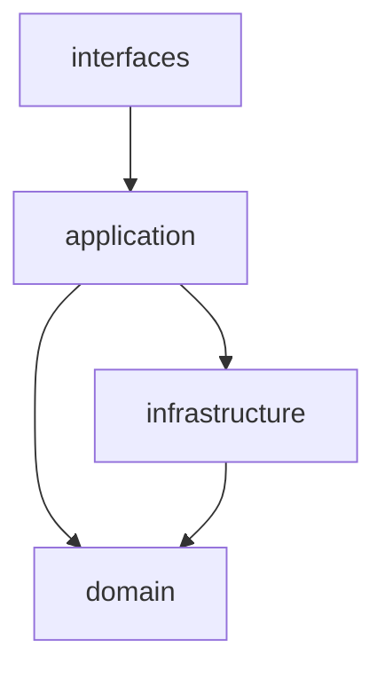
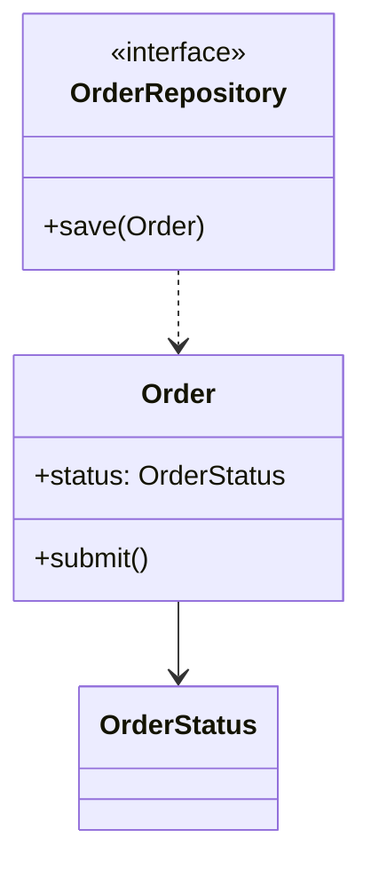
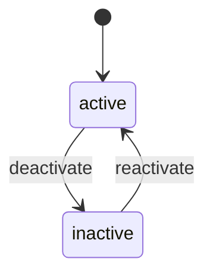

# 低階設計與程式碼地圖 (LLD / Code Map) - [專案名稱]

> **版本:** v1.0 | **更新:** YYYY-MM-DD | **狀態:** 草稿/審核中/已批准
> **Owner:** 架構師維護狀態機（§5，設計契約）；其餘各節為 AS-BUILT 生成物（AI 掃 code 或工具產出）
> **語域:** L3（工程）
>
> **定位**：C4 Code 層——模組結構、檔案依賴、關鍵類別、狀態機。回答「codebase 長什麼樣、誰依賴誰」。
> 系統級架構（L1–L3）歸 [`../03_architecture/sad.md`](../03_architecture/sad.md)；API 契約歸 [`api_spec.md`](./api_spec.md)；資料 schema 歸 [`db_design.md`](./db_design.md)。
> **實例:** 單檔起步；§5 狀態機每個 Aggregate 一節，量大時拆 `lld-<aggregate>.md`

## 目錄

- [1. 生成資訊](#1-生成資訊)
- [2. 模組結構](#2-模組結構)
- [3. 模組依賴圖](#3-模組依賴圖)
- [4. 關鍵類別關係](#4-關鍵類別關係)
- [5. 狀態機（設計契約）](#5-狀態機設計契約)
- [6. 追溯](#6-追溯)

## 1. 生成資訊

§2–§4 描述**程式碼現況（AS-BUILT）**，必須可重新生成，過期即重掃；不得手工修圖後宣稱是現況。

| 項目 | 值 |
| :--- | :--- |
| 生成時間 | YYYY-MM-DD HH:mm |
| 對應 commit | `<sha>` |
| 生成方式 | [AI 掃 code / madge / pydeps / …] |

## 2. 模組結構

```text
src/
├── domain/          # [職責一句話]
├── application/     # [職責一句話]
├── infrastructure/  # [職責一句話]
└── interfaces/      # [職責一句話]
```

| 模組 | 職責（單一） | 對應 SAD 元件 |
| :--- | :--- | :--- |
| `domain/` | [職責] | MOD-* |

## 3. 模組依賴圖

箭頭語意＝import；違反分層（domain → infrastructure）視為缺陷，列入 §6 追溯的待修項。



## 4. 關鍵類別關係

只畫「看不懂就無法安全改動」的核心類別（≤ 10 個），不求全量。



## 5. 狀態機（設計契約）

本節是**人工核准的設計契約**，不是生成物：enum 欄位的合法值與轉移規則在此定義，`db_design` 與 `api_spec`／`openapi.yaml` 引用，不重複定義。**每個 Aggregate 複製一小節**（`### 5.1 訂單`、`### 5.2 工單`…）——狀態機屬於 Aggregate，不屬於功能；多個切片共享同一生命週期時只在這裡改。



| 目前狀態 | 事件 | 下一狀態 | 副作用 |
| :--- | :--- | :--- | :--- |
| active | deactivate | inactive | [通知／稽核紀錄] |

## 6. 追溯

| 項目 | ID／連結 |
| :--- | :--- |
| 上游 | SAD 元件（MOD-*）、FR/NFR-* |
| 下游 | `db_design`／`openapi.yaml` 的 enum 引用、`engineering_tracker.xlsx` ②模組BOM |
| 已知分層違規 | [清單，對應修復任務] |
