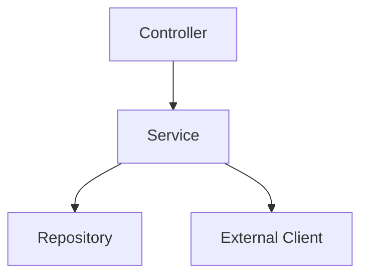
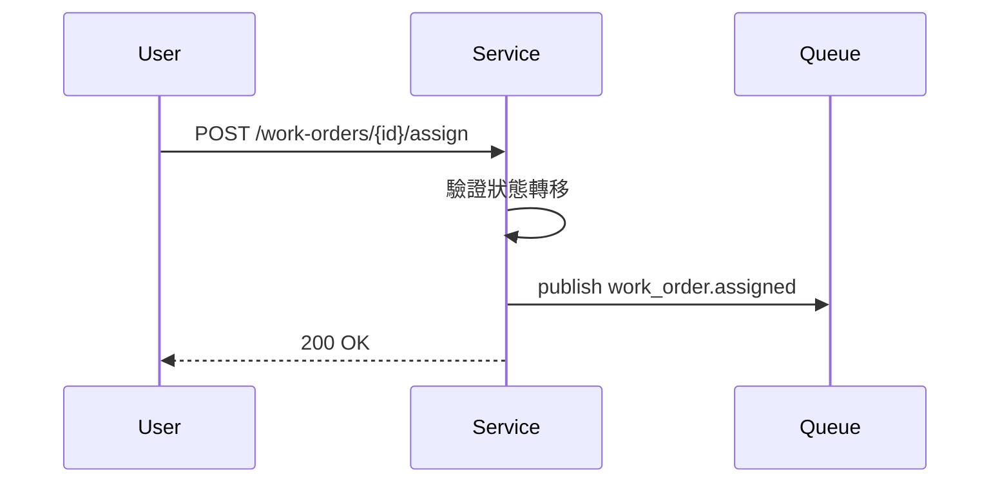

# 軟體設計規格 (SDS) - [服務／模組名稱]

> **版本:** v1.0 | **更新:** YYYY-MM-DD | **狀態:** 草稿/開發中/已完成
> **定位:** SAD 看整體，SDS 看細節。描述單一服務／模組的內部設計：元件、流程、狀態、錯誤處理與契約。
> **對應架構文件**: `../03_architecture/sad.md` §[章節] ｜ **對應 BDD Feature**: [連結]

---

## 1. 元件視圖（C3）



| 元件 | 職責 | 依賴 |
| :--- | :--- | :--- |
| [Service] | [單一職責描述] | [Repository、外部服務] |

類別層級（C4/LLD）必要時見 [`lld.md`](./lld.md) §3。

---

## 2. 關鍵流程時序圖 (Sequence Diagram)

只畫跨元件、跨服務或含第三方的關鍵路徑；單層呼叫不用畫。



---

## 3. 狀態機 (State Machine)

有生命週期的實體（訂單、工單、付款、審核）必須定義狀態機；狀態欄位的合法值以此為準。

```text
draft → pending → assigned → in_progress → completed → closed
                     ↓
                 cancelled
```

| Current State | Action | Next State | Rule |
| :--- | :--- | :--- | :--- |
| pending | assign | assigned | [需指定負責人] |
| assigned | start | in_progress | [只有負責人可操作] |
| in_progress | complete | completed | [需上傳完工證明] |
| assigned | cancel | cancelled | [需填取消原因] |

狀態轉移觸發的事件見 [`event_spec.md`](./event_spec.md)；DB enum 同步見 [`db_design.md`](./db_design.md)。

---

## 4. 錯誤處理與韌性

| 情境 | 行為 | 對使用者 |
| :--- | :--- | :--- |
| [下游 timeout] | [retry 策略／circuit breaker] | [錯誤碼與訊息，對齊 `api_spec.md` §3] |
| [非法狀態轉移] | [拒絕並回 409] | |
| [部分失敗] | [補償／最終一致策略] | |

---

## 5. 模組規格與測試（契約式設計）

### 規格: [函式名稱，例如：AddItemToCart]

**描述**: [簡述功能]

| 類型 | 條件 |
| :--- | :--- |
| **前置條件** | 1. [條件 1] 2. [條件 2] |
| **後置條件** | 1. [條件 1] 2. [條件 2] |
| **不變性** | 1. [條件 1] 2. [條件 2] |

### 測試案例

#### TC-001: 正常路徑

- **Arrange**: [建立初始狀態]
- **Act**: [執行操作]
- **Assert**: [驗證 1] / [驗證 2]

#### TC-002: 邊界情況

- **Arrange**: [建立邊界狀態]
- **Act**: [執行操作]
- **Assert**: [驗證結果]

#### TC-003: 無效輸入 (違反前置條件)

- **Arrange**: [建立狀態]
- **Act**: [傳入無效參數]
- **Assert**: 預期拋出 [ExceptionType]

#### TC-004: 業務規則

- **Arrange**: [建立業務極限狀態]
- **Act**: [觸發業務規則]
- **Assert**: 預期拋出 [BusinessRuleException]

_(複製上方結構，為每個函式/方法建立規格與測試案例)_
