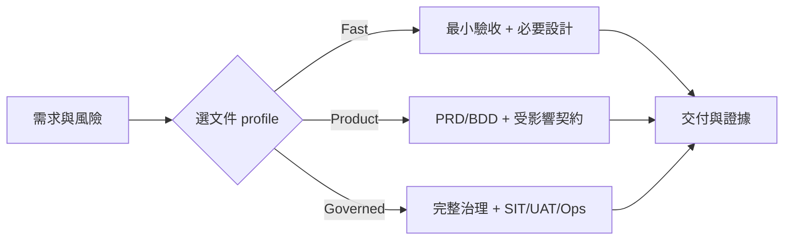

# VibeCoding 工程文件模板索引

> **版本：** v4.1 | **更新：** 2026-07-24

這 18 份模板是工程師可直接裁剪的「作業格式」，不是每份都要建立的固定交付清單，也不是另一套 SSOT。**需求決策（優先序、範圍、Gate）由模板 18 承載，是 owner 拍板、非 AI 衍生的上游；工程契約才由模板 02–17 產生。**

- 企業文件要不要建立：參考 [`software_development_documentation_guide_zh_tw.docx`](../software_development_documentation_guide_zh_tw.docx)
- Excel／Markdown 權威與同步：參考 [`docs/document-system/architecture.md`](../docs/document-system/architecture.md)
- Word、Excel、模板逐項對照：參考 [`docs/document-system/artifact-map.md`](../docs/document-system/artifact-map.md)
- 執行入口：`/intake → /specify → /deliver → /verify`

## 模板清單

| # | 模板 | 主要用途 | 典型 Action |
|---:|---|---|---|
| 01 | [Workflow Manual](./01_workflow_manual.md) | 選擇 Fast／Product／Governed profile 與 Gate | 全流程 |
| 02 | [Project Brief & PRD](./02_project_brief_and_prd.md) | 問題、價值、範圍、FR/NFR、成功指標 | `/specify` |
| 03 | [BDD Guide](./03_behavior_driven_development_guide.md) | 將驗收條件轉成可觀察場景 | `/specify`、`/verify` |
| 04 | [ADR](./04_architecture_decision_record_template.md) | 記錄重要、持久且有取捨的決策 | `/specify` |
| 05 | [Architecture & Design](./05_architecture_and_design_document.md) | C4、DDD、資料、部署與品質屬性 | `/specify` |
| 06 | [API Design](./06_api_design_specification.md) | API／事件介面與 machine-readable contract | `/specify`、`/deliver` |
| 07 | [Module Spec & Tests](./07_module_specification_and_tests.md) | 模組行為、契約、測試設計 | `/specify`、`/deliver` |
| 08 | [Project Structure](./08_project_structure_guide.md) | 新專案或重大目錄調整 | `/specify` |
| 09 | [File Dependencies](./09_file_dependencies_template.md) | impact analysis、複雜依賴與重構 | `/deliver` |
| 10 | [Class Relationships](./10_class_relationships_template.md) | 複雜領域模型／物件協作 | `/specify` |
| 11 | [Review & Refactoring](./11_code_review_and_refactoring_guide.md) | 變更審查、技術債與安全重構 | `/verify`、`/deliver` |
| 12 | [Frontend Architecture](./12_frontend_architecture_specification.md) | 前端狀態、元件、效能與 design system | `/specify`、`/deliver` |
| 13 | [Security & Readiness](./13_security_and_readiness_checklists.md) | 威脅、NFR、安全與上線關卡 | `/specify`、`/verify` |
| 14 | [Deployment & Operations](./14_deployment_and_operations_guide.md) | 部署、回滾、監控、Runbook | `/specify`、`/verify` |
| 15 | [Documentation & Maintenance](./15_documentation_and_maintenance_guide.md) | 文件生命週期、release、維護 | `/verify` |
| 16 | [WBS Development Plan](./16_wbs_development_plan_template.md) | 多階段、跨人員與 Gate 的交付規劃 | `/specify`、`/deliver` |
| 17 | [Frontend IA](./17_frontend_information_architecture_template.md) | 頁面、導航、旅程與資訊架構 | `/specify` |
| 18 | [Requirement Decision Record](./18_requirement_decision_record.md) | owner 拍板的優先序、範圍、里程碑、Gate、業務驗收（Excel B 區的 MD 形態）| `/intake`、`/specify` |

## 不再按序填滿

模板編號只為查找方便，不代表 `01 → 17` 的強制流水線。只讀取與當前範圍直接相關的章節。

## Profile 建議

| Profile | 必要模板 | 依風險加選 |
|---|---|---|
| Fast Track | 01、02 的精簡區、03 或可重現步驟 | 04、06、07、13 |
| Product Track | 01、02、03、受影響的 04/05/06/07 | 前端 12/17、安全 13、部署 14 |
| Governed Track | 依企業文件 catalog 與 artifact map 選用 | 08–16 的治理、證據與營運文件 |

## 使用規則

1. 先確認來源 owner、狀態與穩定 ID。
2. 複製必要章節到目標專案的正式文件，不直接在模板內填專案資料。
3. 已存在的文件做最小更新，不為同一概念建立第二份文件。
4. 模板中的數字、門檻與技術選項是提示，應由專案 NFR／政策決定。
5. Excel B/E 欄位負責業務／證據，工程契約負責 G 投影；不可雙邊人工維護。
6. 只有測試與證據能改變 verification 狀態。

## 版本記錄

| 版本 | 日期 | 變更 |
|---|---|---|
| v4.1 | 2026-07-24 | 新增模板 18 需求決策紀錄（需求側優先）；01 吸收 Word 治理智慧（選用矩陣、命名、反模式）；明確需求/工程決策硬邊界 |
| v4.0 | 2026-07-24 | 整合 Word 文件 catalog、Excel 欄位級 SSOT、四個 Action Skills 與風險式裁剪 |
| v3.1 | 2026-05-26 | 模板 05 補齊 C4、DDD 與跨文件一致性 |
| v3.0 | 2026-03-16 | 精簡並統一繁中 |
| v2.1 | 2025-10-03 | 新增 Frontend IA |
