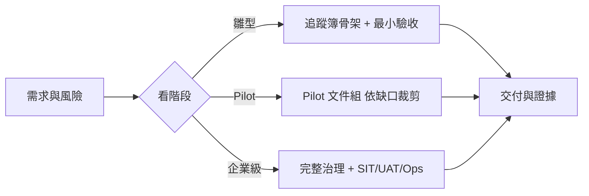

# VibeCoding 工程文件模板索引

> **更新：** 2026-07-27 | 版本隨 repo 走（唯一真相源：README badge；沿革見 [CHANGELOG.md](../CHANGELOG.md)）

這些模板是工程師可直接裁剪的「作業格式」，不是每份都要建立的固定交付清單，也不是另一套 SSOT。**目錄結構本身就是分類**——依 [`software_development_documentation_guide_zh_tw.docx`](../software_development_documentation_guide_zh_tw.docx) 第 15 章的建議資料夾結構（`01_requirements`–`06_ops`）安置，檔名採用該指南的文件詞彙（SAD、SRS、UAT……），用哪份文件看你落在哪一層。

- 怎麼跑流程、選階段、決策邊界：[`_meta/workflow_manual.md`](./_meta/workflow_manual.md)
- Excel／Markdown 權威與同步：[`docs/document-system/architecture.md`](../docs/document-system/architecture.md)
- 九層文件分類與 trace ID：[`docs/document-system/artifact-map.md`](../docs/document-system/artifact-map.md)
- 三個角色追蹤簿的用法：[`docs/document-system/workbook-guide.md`](../docs/document-system/workbook-guide.md)
- 執行入口：`/intake → /specify → /deliver → /verify`

## 目錄結構（依 Word 指南九層分類）

模板庫只內建 **0→1 走到客戶驗收（Pilot）絕對必要的 15 份**＋3 本角色追蹤簿；其餘企業級文件（vision/roadmap、NFR、SDS/LLD、event spec、監控/覆盤、WBS/CR/release note 等）**不內建**，未來依需求按 Word 指南增建，git 歷史中有可回收的舊版。

| 資料夾 | 對應層（Word 章） | 模板 | 典型 Action |
|---|---|---|---|
| [`_meta/`](./_meta/) | 流程指南 | [workflow_manual](./_meta/workflow_manual.md)、[template_standard](./_meta/template_standard.md) | 全流程 |
| [`01_requirements/`](./01_requirements/) | 需求分析（ch5） | [prd](./01_requirements/prd.md)、[brd](./01_requirements/brd.md)、[srs](./01_requirements/srs.md)、`requirements_tracker.xlsx` | `/intake`、`/specify` |
| [`02_ux_ui/`](./02_ux_ui/) | UX／UI（ch6–7） | [ux_research_and_journey](./02_ux_ui/ux_research_and_journey.md)、[information_architecture](./02_ux_ui/information_architecture.md)、[ui_spec](./02_ux_ui/ui_spec.md) | `/specify`、`/deliver` |
| [`03_architecture/`](./03_architecture/) | 系統架構（ch8） | [sad](./03_architecture/sad.md)、[adr](./03_architecture/adr.md)、[diagrams/](./03_architecture/diagrams/)（drawio 溝通級大圖）、`engineering_tracker.xlsx` | `/specify` |
| [`04_design/`](./04_design/) | 技術設計（ch9） | [api_spec](./04_design/api_spec.md)＋[openapi.yaml](./04_design/openapi.yaml)、[db_design](./04_design/db_design.md)、[lld](./04_design/lld.md) | `/specify`、`/deliver` |
| [`05_qa/`](./05_qa/) | QA／測試驗收（ch10） | [test_plan](./05_qa/test_plan.md)、[uat_plan](./05_qa/uat_plan.md)、`qa_tracker.xlsx` | `/verify`、`/deliver` |
| [`06_ops/`](./06_ops/) | DevOps／維運（ch11） | [deployment_and_operations](./06_ops/deployment_and_operations.md)、[runbook](./06_ops/runbook.md) | `/specify`、`/verify` |

> 需求決策的權威是 `requirements_tracker.xlsx`：**①需求決策**（owner 拍板優先序、範圍、里程碑、業務驗收與核准）、**③Gate**（里程碑簽核）、**②決策沿革**（變更與原因）。它是 `/specify` 硬閘的檢查對象（Pilot 階段起生效，見 [workflow_manual](./_meta/workflow_manual.md) §8）。工程契約由模板產生。
>
> 三個 `*_tracker.xlsx` 是角色追蹤簿（看板層），以 `REQ/DEC-* → FR/NFR-* → TC/QTM-*` 的 ID 骨幹互相串連；模板 md 是訂版層。分工見 [workbook-guide](../docs/document-system/workbook-guide.md)。
>
> Wireframe／Prototype／Design System 等以 Figma 為載體的產物不設 md 模板；其交付邊界寫在 [ui_spec](./02_ux_ui/ui_spec.md) §9 Design Handoff。

## 實例化規則（模板 ≠ 實例）

模板是線性清單，實例會長成樹；分支 key 是**穩定錨點**（頁面／決策／Aggregate／症狀／服務），**不以功能開資料夾**——功能視角的樹就是 ID 骨幹（`FR-* → 頁面/Aggregate/SCN`），索引在追蹤簿。詳見 [template_standard §2](./_meta/template_standard.md)。

| 多實例模板 | 每 X 一份 | 命名 |
|---|---|---|
| adr | 決策 | `ADR-NNN-<slug>.md` |
| ui_spec | 頁面 | `ui_spec-<page>.md` |
| openapi | 服務 | `openapi-<service>-v<N>.yaml` |
| lld §5 狀態機 | Aggregate | 一節一個；量大拆 `lld-<aggregate>.md` |
| sad §5 sequence | use case | 一圖一個 |
| uat_plan | 驗收輪次 | `UAT_<專案>_<階段>_<客戶>_<日期>` |
| runbook | 故障症狀 | `runbook-<symptom>.md` |

其餘（brd、prd、srs、ux_research、ia、sad、api_spec 約定、db_design、test_plan、deployment）為**單例**；每份模板的 Metadata 都標了自己的實例規則。

## 不按序填滿

資料夾編號只為對齊 Word 分層，不代表 `00 → 07` 的強制流水線。只讀取與當前範圍直接相關的模板章節。

## 階段建議

文件跟著開發階段走：早期只維護核心骨架，看專案發展再決定是否升級成企業級文件。

| 階段 | 必要模板 | 依風險加選 |
|---|---|---|
| 雛型（Prototype） | `requirements_tracker.xlsx` 骨架列、prd 的問題與驗收段 | adr（僅重大決策）、api_spec |
| Pilot／客戶驗證 | 全部 15 份（brd、prd、srs、ux_research_and_journey、information_architecture、ui_spec、sad、adr、api_spec＋openapi.yaml、db_design、lld、test_plan、uat_plan、deployment_and_operations、runbook），依缺口裁剪 | — |
| 企業級（Enterprise） | 依 Word catalog 與 artifact-map 增建（NFR、SDS/LLD、event spec、監控/覆盤、WBS/CR/release note 等，模板未內建） | — |

## 使用規則

1. 先確認來源 owner、狀態與穩定 ID。
2. 複製必要章節到目標專案的正式文件，不直接在模板內填專案資料。
3. 已存在的文件做最小更新，不為同一概念建立第二份文件。
4. 模板中的數字、門檻與技術選項是提示，應由專案 NFR／政策決定。
5. 追蹤簿由各自 owner 維護骨架（ID＋狀態＋連結），細節在工程契約；同一資訊不可雙邊人工維護。
6. 只有測試與證據能改變 verification 狀態。

## 版本記錄

模板庫不再獨立編號；歷史版本（templates v4.0–v8.4）與後續沿革見根目錄 [CHANGELOG.md](../CHANGELOG.md)。
