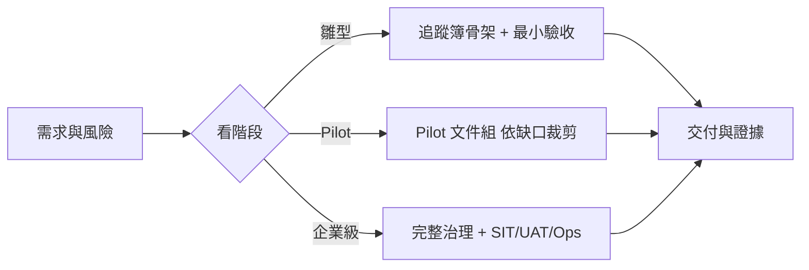

# VibeCoding 工程文件模板索引

> **版本：** v7.0 | **更新：** 2026-07-26

這些模板是工程師可直接裁剪的「作業格式」，不是每份都要建立的固定交付清單，也不是另一套 SSOT。**目錄結構本身就是分類**——依 [`software_development_documentation_guide_zh_tw.docx`](../software_development_documentation_guide_zh_tw.docx) 第 15 章的建議資料夾結構（`00_strategy`–`07`）安置，檔名採用該指南的文件詞彙（SAD、SDS、SRS、NFR……），用哪份文件看你落在哪一層。

- 怎麼跑流程、選階段、決策邊界：[`_meta/workflow_manual.md`](./_meta/workflow_manual.md)
- Excel／Markdown 權威與同步：[`docs/document-system/architecture.md`](../docs/document-system/architecture.md)
- 九層文件分類與 trace ID：[`docs/document-system/artifact-map.md`](../docs/document-system/artifact-map.md)
- 三個角色追蹤簿的用法：[`docs/document-system/workbook-guide.md`](../docs/document-system/workbook-guide.md)
- 執行入口：`/intake → /specify → /deliver → /verify`

## 目錄結構（依 Word 指南九層分類）

| 資料夾 | 對應層（Word 章） | 模板 | 典型 Action |
|---|---|---|---|
| [`_meta/`](./_meta/) | 流程指南 | [workflow_manual](./_meta/workflow_manual.md) | 全流程 |
| [`00_strategy/`](./00_strategy/) | 產品與商業（ch4） | [product_vision](./00_strategy/product_vision.md)、[roadmap](./00_strategy/roadmap.md) | `/intake` |
| [`01_requirements/`](./01_requirements/) | 需求分析（ch5） | [prd](./01_requirements/prd.md)、[brd](./01_requirements/brd.md)、[srs](./01_requirements/srs.md)、[bdd_guide](./01_requirements/bdd_guide.md)、`requirements_tracker.xlsx` | `/intake`、`/specify` |
| [`02_ux_ui/`](./02_ux_ui/) | UX／UI／前端（ch6–7） | [ux_research_and_journey](./02_ux_ui/ux_research_and_journey.md)、[information_architecture](./02_ux_ui/information_architecture.md)、[ui_spec](./02_ux_ui/ui_spec.md)、[frontend_technical_design](./02_ux_ui/frontend_technical_design.md) | `/specify`、`/deliver` |
| [`03_architecture/`](./03_architecture/) | 系統架構（ch8） | [sad](./03_architecture/sad.md)、[adr](./03_architecture/adr.md)、[nfr](./03_architecture/nfr.md)、`engineering_tracker.xlsx` | `/specify` |
| [`04_design/`](./04_design/) | 技術設計（ch9） | [sds](./04_design/sds.md)、[lld](./04_design/lld.md)、[api_spec](./04_design/api_spec.md)＋[openapi.yaml](./04_design/openapi.yaml)、[event_spec](./04_design/event_spec.md)＋[asyncapi.yaml](./04_design/asyncapi.yaml)、[db_design](./04_design/db_design.md) | `/specify`、`/deliver` |
| [`05_qa/`](./05_qa/) | QA／測試驗收（ch10） | [test_plan](./05_qa/test_plan.md)、[uat_plan](./05_qa/uat_plan.md)、[security_and_readiness](./05_qa/security_and_readiness.md)、`qa_tracker.xlsx` | `/verify`、`/deliver` |
| [`06_ops/`](./06_ops/) | DevOps／維運（ch11） | [deployment_and_operations](./06_ops/deployment_and_operations.md)、[runbook](./06_ops/runbook.md)、[monitoring_spec](./06_ops/monitoring_spec.md)、[incident_postmortem](./06_ops/incident_postmortem.md) | `/specify`、`/verify` |
| [`07_governance/`](./07_governance/) | 專案治理（ch12） | [wbs_development_plan](./07_governance/wbs_development_plan.md)、[change_request](./07_governance/change_request.md)、[release_note](./07_governance/release_note.md) | `/specify`、`/verify` |

> 需求決策的權威是 `requirements_tracker.xlsx`：**①需求決策**（owner 拍板優先序、範圍、里程碑、業務驗收與核准）、**③Gate**（里程碑簽核）、**②決策沿革**（變更與原因）。它是 `/specify` 硬閘的檢查對象（Pilot 階段起生效，見 [workflow_manual](./_meta/workflow_manual.md) §8）。工程契約由模板產生。
>
> 三個 `*_tracker.xlsx` 是角色追蹤簿（看板層），以 `REQ/DEC-* → FR/NFR-* → TC/QTM-*` 的 ID 骨幹互相串連；模板 md 是訂版層。分工見 [workbook-guide](../docs/document-system/workbook-guide.md)。
>
> Wireframe／Prototype／Design System 等以 Figma 為載體的產物不設 md 模板；其交付邊界寫在 [ui_spec](./02_ux_ui/ui_spec.md) §9 Design Handoff。

## 不按序填滿

資料夾編號只為對齊 Word 分層，不代表 `00 → 07` 的強制流水線。只讀取與當前範圍直接相關的模板章節。

## 階段建議

文件跟著開發階段走：早期只維護核心骨架，看專案發展再決定是否升級成企業級文件。

| 階段 | 必要模板 | 依風險加選 |
|---|---|---|
| 雛型（Prototype） | `requirements_tracker.xlsx` 骨架列、prd 的問題與驗收段 | adr（僅重大決策）、api_spec |
| Pilot／客戶驗證 | brd、prd、srs、ux_research_and_journey、ui_spec、sad、adr、api_spec＋openapi.yaml、db_design、test_plan、uat_plan、deployment_and_operations、runbook（依缺口裁剪） | nfr、security_and_readiness、bdd_guide |
| 企業級（Enterprise） | 依 Word catalog 與 artifact-map 全量選用 | sds/lld、event_spec、monitoring/runbook、wbs、change_request、release_note |

## 使用規則

1. 先確認來源 owner、狀態與穩定 ID。
2. 複製必要章節到目標專案的正式文件，不直接在模板內填專案資料。
3. 已存在的文件做最小更新，不為同一概念建立第二份文件。
4. 模板中的數字、門檻與技術選項是提示，應由專案 NFR／政策決定。
5. 追蹤簿由各自 owner 維護骨架（ID＋狀態＋連結），細節在工程契約；同一資訊不可雙邊人工維護。
6. 只有測試與證據能改變 verification 狀態。

## 版本記錄

| 版本 | 日期 | 變更 |
|---|---|---|
| v7.0 | 2026-07-26 | 退役 requirement_decision_record（權威併入 requirements_tracker ①需求決策＋③Gate＋②決策沿革，硬閘 checklist 移入 workflow_manual §8）；Profile 改為開發階段（雛型／Pilot／企業級），雛型期心流優先 |
| v6.1 | 2026-07-26 | 整併舊模板：project_structure＋file_dependencies＋class_relationships 併入 lld；CHANGELOG 模板併入 release_note；code_review 與 documentation_and_maintenance 退役（職責在 git-workflow 規則與 Skills） |
| v6.0 | 2026-07-26 | 全面對齊 Word 指南：補 00_strategy、BRD/SRS、UX/UI Spec、NFR、DB/Event、Test/UAT、Runbook/Monitoring/Postmortem、Release/CR；檔名改用指南詞彙（sad、sds、api_spec…）；00_meta 改為 _meta |
| v5.0 | 2026-07-24 | 依 Word 九層分類把模板從扁平編號改為 `00`–`07` 資料夾＋語義命名；結構取代對照表 |
| v4.1 | 2026-07-24 | 新增需求決策紀錄；01 吸收 Word 治理智慧；需求/工程決策硬邊界 |
| v4.0 | 2026-07-24 | 整合 Word catalog、Excel 欄位級 SSOT、四個 Action Skills 與風險式裁剪 |
