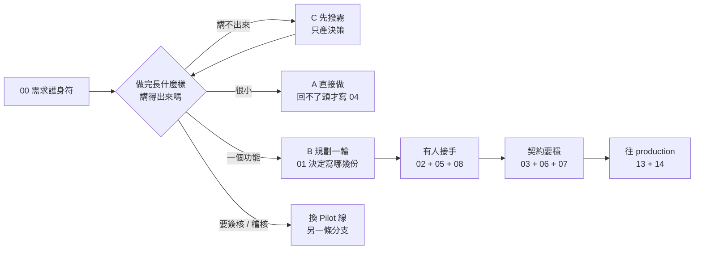

# VibeCoding 工作流程模板索引

> **版本:** v3.3 | **更新:** 2026-08-05

---

## 模板清單

### 階段 0: 總覽與工作流

| # | 檔名 | 用途 |
| :---: | :--- | :--- |
| 00 | [requirements_amulet.md](./00_requirements_amulet.md) | **需求護身符**：角色分工、FR／NFR 必問、開場檢查表（每個專案先過） |
| 01 | [workflow_manual.md](./01_workflow_manual.md) | **模板選用路由**：這個專案該寫哪幾份、何時換 Pilot 線（操作層見 `.claude/PLAYBOOK.md`） |

> 剛把這套 harness 複製到新專案、還沒開始寫任何文件？先看 [`_meta/new_project_bootstrap.md`](./_meta/new_project_bootstrap.md)——它不是模板，是起步順序（收集專案資訊、生成該專案的 `CLAUDE.md`），不計入下面的 18 份。

### 階段 1: 規劃 (02-03)

| # | 檔名 | 用途 |
| :---: | :--- | :--- |
| 02 | [project_brief_and_prd.md](./02_project_brief_and_prd.md) | 專案簡報與 PRD |
| 03 | [behavior_driven_development_guide.md](./03_behavior_driven_development_guide.md) | BDD 指南與 Gherkin 範本 |

### 階段 2: 架構與設計 (04-06)

| # | 檔名 | 用途 |
| :---: | :--- | :--- |
| 04 | [architecture_decision_record_template.md](./04_architecture_decision_record_template.md) | ADR 模板 |
| 05 | [architecture_and_design_document.md](./05_architecture_and_design_document.md) | 架構與設計文檔 (C4/DDD) |
| 06 | [api_design_specification.md](./06_api_design_specification.md) | API 設計規範 |

### 階段 3: 詳細設計 (07-10)

| # | 檔名 | 用途 |
| :---: | :--- | :--- |
| 07 | [module_specification_and_tests.md](./07_module_specification_and_tests.md) | 模組規格與測試案例 (DbC) |
| 08 | [project_structure_guide.md](./08_project_structure_guide.md) | 專案結構指南 |
| 09 | [file_dependencies_template.md](./09_file_dependencies_template.md) | 模組依賴關係分析 |
| 10 | [class_relationships_template.md](./10_class_relationships_template.md) | 類別關係文檔 (UML) |

### 階段 4: 開發與品質 (11-12, 17)

| # | 檔名 | 用途 |
| :---: | :--- | :--- |
| 11 | [code_review_and_refactoring_guide.md](./11_code_review_and_refactoring_guide.md) | 程式碼審查與重構指南 |
| 12 | [frontend_architecture_specification.md](./12_frontend_architecture_specification.md) | 前端架構規範 |
| 17 | [frontend_information_architecture_template.md](./17_frontend_information_architecture_template.md) | 前端資訊架構規範 |

### 階段 5: 安全與部署 (13-14)

| # | 檔名 | 用途 |
| :---: | :--- | :--- |
| 13 | [security_and_readiness_checklists.md](./13_security_and_readiness_checklists.md) | 安全與生產準備檢查清單 |
| 14 | [deployment_and_operations_guide.md](./14_deployment_and_operations_guide.md) | 部署與運維指南 |

### 階段 6: 維護與管理 (15-16)

| # | 檔名 | 用途 |
| :---: | :--- | :--- |
| 15 | [documentation_and_maintenance_guide.md](./15_documentation_and_maintenance_guide.md) | 文檔與維護指南 |
| 16 | [wbs_development_plan_template.md](./16_wbs_development_plan_template.md) | WBS 開發計劃模板 |

---

## 使用流程

**00 是唯一固定的入口，之後分岔。** 這 18 份是能力庫，不是待辦清單——順序照專案走，不照編號走。

A／B／C 三條路線的走查在 [`.claude/PLAYBOOK.md`](../.claude/PLAYBOOK.md)；每份模板的取用時機在 [`01`](./01_workflow_manual.md)。

---

## 依角色查找

| 角色 | 常用模板 |
| :--- | :--- |
| PM | 00, 02, 03 |
| SA | 00, 02, 03 |
| TL | 00, 04, 05 |
| ARCH | 00, 05, 09, 10 |
| SD | 00, 06, 07 |
| 後端 DEV | 07, 08, 11 |
| 前端 DEV | 12, 17 |
| SEC | 13 |
| SRE/OPS | 14 |

---

## 版本記錄

| 版本 | 日期 | 變更 |
| :--- | :--- | :--- |
| v3.3 | 2026-08-05 | 01 重新定位為模板選用路由；移除與 POC 線衝突的簽核 Gate 與雙模式，修正 7 個不存在的檔名引用；使用流程從線性強制鏈改為「00 入口 → A／B／C／Pilot 分岔」 |
| v3.2 | 2026-08-05 | 新增 00 需求護身符（角色 × FR × NFR）；INDEX 流程與角色表對齊 |
| v3.1 | 2026-05-26 | 模板 05 升 v2.0：依實戰回灌補齊 C4 嚴格規則、命名防呆、Sequence/Deployment 必填、DDD 戰略+戰術雙層、跨文件一致性 checklist |
| v3.0 | 2026-03-16 | 全面精簡優化，移除冗餘的 01_cookbook，統一繁中 |
| v2.1 | 2025-10-03 | 新增 17_frontend_information_architecture |
| v2.0 | 2025-10-03 | 重新組織序號，新增 INDEX |
| v1.0 | 2025-10-01 | 初始版本 |
