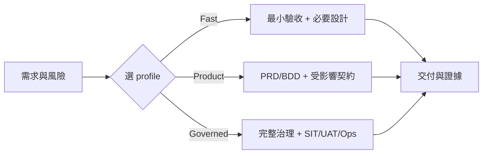

# VibeCoding 工程文件模板索引

> **版本：** v5.0 | **更新：** 2026-07-24

這些模板是工程師可直接裁剪的「作業格式」，不是每份都要建立的固定交付清單，也不是另一套 SSOT。**目錄結構本身就是分類**——依 [`software_development_documentation_guide_zh_tw.docx`](../software_development_documentation_guide_zh_tw.docx) 的九層文件分類（`00`–`07`）安置，用哪份文件看你落在哪一層，不必再查對照表。

- 怎麼跑流程、選 profile、決策邊界：[`00_meta/workflow_manual.md`](./00_meta/workflow_manual.md)
- Excel／Markdown 權威與同步：[`docs/document-system/architecture.md`](../docs/document-system/architecture.md)
- 九層文件分類與 trace ID：[`docs/document-system/artifact-map.md`](../docs/document-system/artifact-map.md)
- 執行入口：`/intake → /specify → /deliver → /verify`

## 目錄結構（依 Word 九層分類）

| 資料夾 | 對應層 | 模板 | 典型 Action |
|---|---|---|---|
| [`00_meta/`](./00_meta/) | 流程指南 | [workflow_manual](./00_meta/workflow_manual.md) | 全流程 |
| [`01_requirements/`](./01_requirements/) | 需求與產品 | [requirement_decision_record](./01_requirements/requirement_decision_record.md)、[project_brief_and_prd](./01_requirements/project_brief_and_prd.md)、[bdd_guide](./01_requirements/bdd_guide.md) | `/intake`、`/specify` |
| [`02_ux_ui/`](./02_ux_ui/) | UX／UI／前端 | [frontend_information_architecture](./02_ux_ui/frontend_information_architecture.md)、[frontend_architecture_spec](./02_ux_ui/frontend_architecture_spec.md) | `/specify`、`/deliver` |
| [`03_architecture/`](./03_architecture/) | 系統架構 | [architecture_and_design](./03_architecture/architecture_and_design.md)、[adr](./03_architecture/adr.md)、[project_structure](./03_architecture/project_structure.md) | `/specify` |
| [`04_design/`](./04_design/) | 技術設計 | [api_design](./04_design/api_design.md)、[module_spec_and_tests](./04_design/module_spec_and_tests.md)、[file_dependencies](./04_design/file_dependencies.md)、[class_relationships](./04_design/class_relationships.md) | `/specify`、`/deliver` |
| [`05_qa/`](./05_qa/) | QA／測試／安全 | [code_review_and_refactoring](./05_qa/code_review_and_refactoring.md)、[security_and_readiness](./05_qa/security_and_readiness.md) | `/verify`、`/deliver` |
| [`06_ops/`](./06_ops/) | DevOps／維運 | [deployment_and_operations](./06_ops/deployment_and_operations.md) | `/specify`、`/verify` |
| [`07_governance/`](./07_governance/) | 專案治理 | [wbs_development_plan](./07_governance/wbs_development_plan.md)、[documentation_and_maintenance](./07_governance/documentation_and_maintenance.md) | `/specify`、`/verify` |

> `01_requirements/requirement_decision_record` 是需求側起手件：owner 拍板的優先序、範圍、Gate（Excel B 區的 MD 形態），是 `/specify` 硬閘的檢查對象。工程契約由其餘模板產生。

## 不按序填滿

資料夾編號只為對齊 Word 分層，不代表 `00 → 07` 的強制流水線。只讀取與當前範圍直接相關的模板章節。

## Profile 建議

| Profile | 必要模板 | 依風險加選 |
|---|---|---|
| Fast Track | 00_meta、01_requirements 的精簡區 | 03 架構的 adr、04 的 api_design/module_spec |
| Product Track | 01_requirements 全、受影響的 03/04 | 02 前端、05 安全、06 部署 |
| Governed Track | 依 Word catalog 與 artifact-map 選用 | 03–07 的治理、證據與營運文件 |

## 使用規則

1. 先確認來源 owner、狀態與穩定 ID。
2. 複製必要章節到目標專案的正式文件，不直接在模板內填專案資料。
3. 已存在的文件做最小更新，不為同一概念建立第二份文件。
4. 模板中的數字、門檻與技術選項是提示，應由專案 NFR／政策決定。
5. Excel B/E 欄位負責業務／證據，工程契約負責 G 投影；不可雙邊人工維護。
6. 只有測試與證據能改變 verification 狀態。

## 版本記錄

| 版本 | 日期 | 變更 |
|---|---|---|
| v5.0 | 2026-07-24 | 依 Word 九層分類把模板從扁平編號改為 `00`–`07` 資料夾＋語義命名；結構取代對照表 |
| v4.1 | 2026-07-24 | 新增需求決策紀錄；01 吸收 Word 治理智慧；需求/工程決策硬邊界 |
| v4.0 | 2026-07-24 | 整合 Word catalog、Excel 欄位級 SSOT、四個 Action Skills 與風險式裁剪 |
