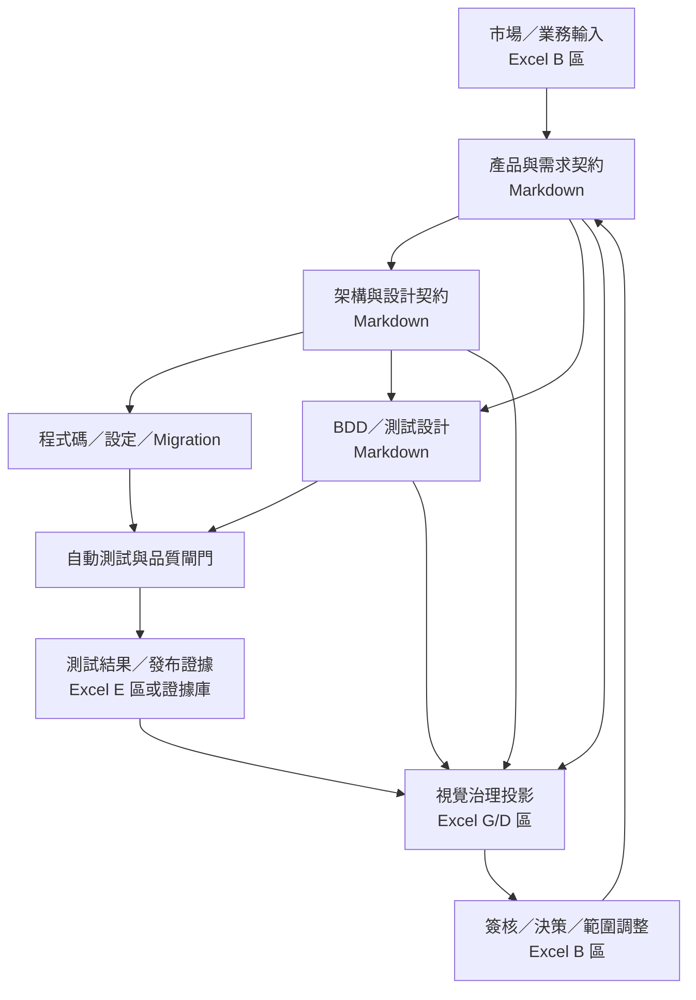

# 文件驅動開發系統架構

> 狀態：目標架構
>
> 適用模式：MVP、Full
>
> 配套對照：[文件與範本對照表](artifact-map.md)

## 1. 目的與範圍

這套文件系統把產品、工程、驗收與營運資訊串成一條可追溯的開發鏈，而不是要求 AI 依序填完所有範本。系統的核心分工是：

- **Excel 保留視覺協作與 B/E 欄位 SSOT**：供業務、產品、專案、QA 與核准者檢視、篩選、討論、簽核及保存執行證據。
- **Markdown 保存工程契約**：供人員、AI、Git、CI 與程式碼審查共同讀取，承載需求、架構、介面、測試與營運契約。
- **程式碼、測試與證據驗證契約**：實作狀態不能只靠文件宣告。
- **穩定 ID 串接各層**：檔名、列號、工作表列與顯示名稱都不是跨文件主鍵。

本架構整合 Excel 視覺治理、Markdown 工程契約、Word 企業文件目錄與 `VibeCoding_Workflow_Templates`。它源自一個真實的四書治理實例（已抽離為外部範例，不再隨附），保留可重用的 pattern，不綁任何特定領域資料。

## 2. 來源判讀與已知陷阱

### 2.1 生成活頁簿的 pattern 與陷阱

四書活頁簿常見做法是由工程正典 Markdown **單向生成的發布快照**：沒有公式，也不是安全的雙向編輯介面。這代表「Excel 是業務 SSOT」必須定義到**欄位所有權**，不能直接解讀成「任何儲存格都能手動編輯」：

- 生成活頁簿先視為可閱讀、可簽核的發布視圖。
- 在產生器能保留業務輸入與執行證據之前，不應直接維護其生成欄位。
- 應新增獨立的業務輸入／執行證據區，或讓產生器依穩定 ID round-trip 並保留人工欄位。

**因果方向（需求優先）**：純由 `04_SRS` 等工程正典**向下生成**活頁簿，會使優先序、Owner、範圍、Gate 這些**需求決策**被產生器規則（如以關鍵字判優先序、自動指派 owner）推斷——等於 AI 替 owner 拍板。目標要把因果翻轉：**需求決策是上游、由產品 owner 於 B 區拍板（見 [`18 需求決策紀錄`](../../VibeCoding_Workflow_Templates/18_requirement_decision_record.md)），工程契約與生成欄位是下游衍生。** 把這些決策從產生器規則**外部化成 owner 可編輯的資料**，並與 G 區生成欄分頁隔離，是關鍵原則。

### 2.2 追溯骨架

一個成熟實例的追溯基礎通常包含數十條 FR、上百條 NFR／測試映射，以及能力群與元件詞彙。可重用的是結構，不是數字：

- 主鏈可整理為：`BR/PRD → FR/NFR → 驗收條件 → QTM/TS → TC → SIT/UAT 證據`。
- 能力群等 L2 標籤是閱讀用分組，不是 join key。
- 舊版顯示編號（如 `FR-0001`）不應取代既有正式 ID（如 `FR-<領域>-*`）。

### 2.3 文件不是同一種狀態

以下四個狀態軸必須分開：

1. **Requirement status**：需求是否草擬、核准、延後或取消。
2. **Code reality**：AS-BUILT、PARTIAL、TO-BE。
3. **Verification status**：未測、通過、失敗、阻擋。
4. **Release status**：未排程、候選、已發布、已回滾。

任何單一「狀態」欄都不能同時代表這四件事。

## 3. 目標分層



| 層 | 主要內容 | 主要載體 | 權威來源 |
|---|---|---|---|
| 業務治理 | VOC、優先序、範圍、Owner、里程碑決策、簽核 | Excel | Excel 的 B 區 |
| 產品契約 | PRD、FR、NFR、驗收條件 | Markdown | Git 中的工程契約 |
| 架構契約 | SAD、ADR、SDS、API、事件、資料模型 | Markdown | Git 中的工程契約 |
| 實作 | 程式碼、Schema、IaC、設定 | Repository | 可執行成品 |
| 驗證 | BDD、QTM、TC、CI、自動／人工測試 | Markdown + 測試工具 | 測試定義與結果各自為準 |
| 證據與發布 | 實測結果、缺陷、UAT、版本、部署、Runbook | Excel E 區 + 證據儲存處 + Markdown | 不可變證據與核准紀錄 |
| 視覺投影 | 模組 BOM、驗收控制表、整合測試計畫、統控規劃 | Excel | 由上述 SSOT 生成或保留 |

## 4. Excel 的欄位級所有權

每個工作表欄位都必須在 schema 中標記為下列一種區域；同一資訊不得同時在 Excel 與 Markdown 人工維護。

| 區域 | 名稱 | 誰可以編輯 | 例子 | 重新生成規則 |
|---|---|---|---|---|
| B | Business-owned | 產品、業務、PM、核准者 | VOC、商業優先序、範圍決定、Owner、Gate 決策 | 必須保留，不得覆蓋 |
| E | Evidence-owned | QA、UAT、Release、Ops | 實際結果、缺陷／證據連結、執行版本、日期、簽核 | 必須依穩定 ID 合併，不得覆蓋 |
| G | Generated contract | 由 Markdown／程式碼產生 | FR/NFR 文字、SAD/SDS 對照、測試設計、API 映射 | 可以重建；禁止直接維護 |
| D | Derived | 公式或產生器計算 | 覆蓋率、風險彙總、完成率、Dashboard | 可以重算；唯讀 |

### 4.1 Round-trip 規則

1. 每個 B/E 記錄必須帶穩定 ID；不以列號或儲存格位置配對。
2. 產生器先讀取現有 B/E，再生成 G/D，最後依 ID 合併回新檔。
3. 對不上 ID 的人工記錄進入 quarantine 報告，不可靜默丟棄。
4. ID 重複、孤兒連結、循環 supersedes 或非法狀態都要使驗證失敗。
5. 生成檔要寫入來源 commit、產生時間、schema 版本與產生器版本。
6. 合併前後輸出 B/E 欄位雜湊，證明人工內容未被改寫。
7. 若尚未具備上述機制，活頁簿維持「發布／簽核快照」定位。

## 5. 四本治理活頁簿的職責（pattern）

以下是可重用的四書 pattern，活頁簿名稱是通用原型，非特定專案實例：

| 活頁簿 | 主要受眾 | 核心職責 | 目標 B/E 區 | G/D 投影 |
|---|---|---|---|---|
| 規格統控規劃書 | Sponsor、PM、架構師 | 里程碑、需求批次、架構決策、風險與 Gate | 優先序、Owner、範圍與 Gate 決定 | FR/NFR 摘要、WBS、ADR、模組與 code reality |
| 業務邏輯驗收控制表 | PO、BA、UAT、PM | 把需求轉成可閱讀、可核准的業務驗收面 | VOC、商業例外、UAT Owner、核准結果 | FR/NFR、驗收條件、成功指標、元件映射 |
| 模組功能 BOM | 架構、Tech Lead、PM | 呈現需求到能力、元件與實作證據的分解 | 責任人、例外核准（若需要） | L1/L2/L3、SAD/SDS locator、code reality、證據路徑 |
| 整合測試計畫 | QA、RD、UAT、Release | 測試策略、場景、執行與放行證據 | E 區：結果、證據、缺陷、版本、執行者、日期 | QTM、TS、TC/CASE、環境、RACI、覆蓋率 |

詳細工作表分工見[文件與範本對照表](artifact-map.md)。

## 6. Markdown 工程契約

Markdown 只承載會直接驅動設計、實作、驗證或營運的內容。每份契約都應：

- 有明確 Owner、狀態、版本與最後核准者。
- 在正文使用正式 ID，並連到上／下游 ID。
- 對行為寫可驗證的 acceptance criteria 或 BDD。
- 對架構決策寫 ADR；不把決策理由藏在聊天記錄。
- 對外部與跨模組邊界提供 machine-readable contract 時，Markdown 是說明層，OpenAPI／AsyncAPI／Schema 才是可執行層。
- 與程式碼現況分離描述；「需求已核准」不等於「已實作」。
- 只建立當下風險與協作需要的文件，不因為目錄存在就填滿。

Word 指南中的大型企業文件目錄是**可選文件目錄與治理檢查表**，不是要求在每個專案複製 27 份文件。VibeCoding 範本則是建立／更新 Markdown 契約時的作業手冊，不是另一套 SSOT。

## 7. 追溯 ID 模型

### 7.1 主鏈

```text
SRC
  → REQ
  → BR/PRD
  → FR / NFR
  → ACPT
  → BDD / SCN
  → SAD / SDS / ADR / API / EVT / DB / MOD
  → TS / QTM
  → TC / CASE
  → EV
  → UAT / REL
```

### 7.2 ID 原則

- 保留現有正式 ID：`FR-*`、`NFR-*`、`ADR-*`、`TS-*`、`QTM-*`、`TC-*`、`SCN-*`、`CASE-*`。
- 進件來源使用 `SRC-*`，正規化但尚未工程分類的需求使用 `REQ-*`；核准後映射到一個或多個 `FR-*`／`NFR-*`，不可跳過來源關係。
- 新增時可用：`BR-*`、`ACPT-*`、`API-*`、`EVT-*`、`DB-*`、`MOD-*`、`EV-*`、`CR-*`、`REL-*`。
- 驗收條件使用 `ACPT-*`，避免與現有規劃表中的架構選項 `AC-01` 混淆。
- WBS 可用 `WBS-M1-001`；列號、標題與 anchor 只當 locator。
- ID 一經發布不得重用；取消保留 tombstone，替代關係用 `supersedes`。

### 7.3 最小追溯記錄

```yaml
id: ACPT-LOCK-001
type: acceptance-criterion
source_artifact: docs/requirements/srs.md
source_locator: "#fr-agt-lock-001"
upstream_ids: [FR-AGT-LOCK-001]
downstream_ids: [SCN-LOCK-001, QTM-LOCK-001]
status: approved
owner: product
version: "1.2"
evidence: []
supersedes: []
```

Excel locator 可寫成 `工作表!儲存格`，Markdown locator 可寫成 `path#anchor`，但 locator 改變不代表 ID 改變。

## 8. 文件生命週期

1. **Intake**：在 Excel B 區／`18 需求決策紀錄` 記錄問題、價值、Owner、優先序與範圍決定；owner 決策欄留給 owner 填，不由 AI 衍生。
2. **Specify（硬閘）**：只有在需求決策 `已核准`（有決策者與日期）後，才把核准範圍轉成 PRD、FR/NFR、ACPT 與 BDD Markdown 契約；owner 未簽核前不得工程化。
3. **Design**：只針對有風險的邊界建立 SAD/SDS、ADR、API、資料與事件契約。
4. **Plan**：以 ID 建立 WBS、測試策略與交付切片。
5. **Implement**：AI／工程師先讀取相關契約與 repo 現況，再修改程式碼；不需要先建立額外的 task database。
6. **Verify**：自動測試、人工測試與 code reality 掃描回寫各自狀態。
7. **Publish**：產生四本 Excel 的 G/D 視圖，同時無損合併 B/E。
8. **Approve/Release**：在 Excel 與證據庫完成核准，產出 release／runbook；範圍變更再回到 Specify。

每次只載入與當前 ID 有關的文件切片，避免把整套模板當成固定 prompt context。

## 9. MVP 與 Full 模式

### 9.1 MVP

適合單一團隊、可逆變更、低法遵風險與短週期交付。

最低集合：

- 一份精簡 business register／相應 Excel 視圖，保存問題、價值、Owner、優先序與核准。
- Lean PRD／Tech Spec，含 FR/NFR、ACPT 與主要風險。
- 核心 BDD／驗收場景。
- 一份架構說明；只有真正決策才建立 ADR。
- 有跨系統介面時才建立 API／事件契約。
- 測試清單、驗證證據與 release note。
- 有正式部署／on-call 責任時加入 deployment／runbook。

### 9.2 Full

適合多團隊、長生命週期、外部契約、法遵／稽核、正式 UAT、高可用或不可逆遷移。

在 MVP 基礎上加入：

- Word 指南中適用的企業文件類別與治理責任。
- 四本視覺治理活頁簿。
- 完整 FR/NFR、SAD/SDS、ADR、API/AsyncAPI、DB、Test Plan/Cases、Traceability、UAT、Deployment、Runbook、Monitoring。
- 全鏈 trace matrix、覆蓋率、孤兒檢查與不可變證據。
- B/E round-trip、schema versioning 與發布稽核。

### 9.3 升級條件

MVP 遇到下列任一條件就應評估升級 Full：

- 個資、資安、金融、醫療、法遵或合約責任。
- 多團隊／供應商協作，或跨服務公開契約。
- 高可用、災難復原、正式 on-call。
- 大量資料遷移、不可逆 schema／協議變更。
- 需正式 UAT、外部稽核或完整簽核證據。

## 10. AI、Skills 與文件系統的關係

文件是專案知識與決策的持久層；Skills 是「如何執行」的可重用流程。AI 應依工作階段讀取相關契約，由 Skill 驗證輸入、產出與 quality gate，而不是依賴長駐 context、task database 或大量 hooks 來重述文件。

建議邊界：

- **Rules**：只放任何任務都不可違反的 Golden Rules。
- **Skills**：封裝 intake、specify、deliver、verify 等有開始、結束與驗證條件的流程。
- **Agents**：只在平行探索、專業隔離或獨立驗證確實有價值時使用；不複製 Skills 內容。
- **Output style**：只管回覆表達與格式，不承載流程或政策。
- **Hooks**：只做確定性、自動化且便宜的 guardrail；不當主要 orchestration。

## 11. 導入順序

1. 先凍結並公布 ID 規範與四個狀態軸。
2. 為每本活頁簿建立欄位 schema，逐欄標記 B/E/G/D。
3. 把現有檔案定位為 published snapshots，避免誤以為可直接維護。
4. 選擇一種 B/E 保存方案：獨立輸入工作表／活頁簿，或 preservation-safe generator。
5. 補回或明確映射產生器缺少的上游 Markdown canonical paths。
6. 建立 trace validator、孤兒檢查、ID 重複檢查及 B/E round-trip 測試。
7. 先以一個 MVP feature 試跑，再擴展到 Full。

## 12. 來源

- [需求決策紀錄（模板 18）](../../VibeCoding_Workflow_Templates/18_requirement_decision_record.md)
- [大型軟體公司開發文件指南](../../software_development_documentation_guide_zh_tw.docx)
- [VibeCoding 工作流範本索引](../../VibeCoding_Workflow_Templates/INDEX.md)

> 本架構原始的四書治理實例（SmartLock）已抽離為外部範例，不再隨附於本 repo。
